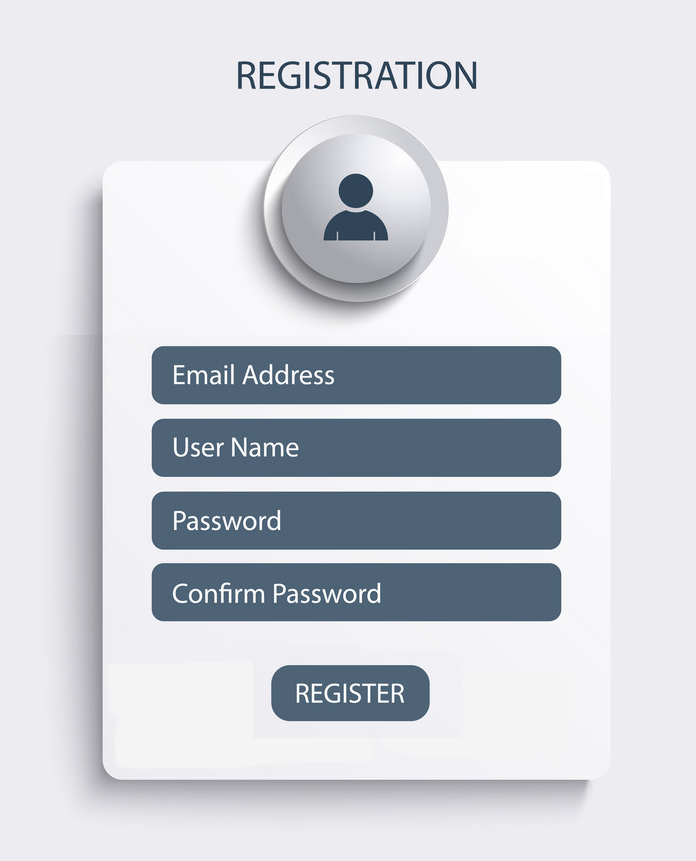

# Registrační formulář

V projektu připraveném v tomto repozitáři vytvořte React komponentu `Registration`, která bude představovat registrační formulář do nějaké webové aplikace, viz obrázek.



Stylování komponenty řešit nemusíte.

1. Vytvořte složku `src/components` a založte v ní komponentu `Registration`. 
1. V komponentě vytvořte jeden stav `user`. Ve stavu bude objekt reprezentující všechna data ve formuláři. Objekt bude mít následující strukturu:
   ```js
   {
      username: '',
      email: '',
      password: '',
      passwordConfirm: '',
   }
   ```
1. Provažte obsah formuláře se stavem `user`.
1. Budeme chtít, aby se ve formuláři automaticky vyplnilo políčko User Name, pokud je User Name prázdné a pokud uživatel zadá validní email. Validní email poznáme tak, že obsahuje zavináč. Do User Name se pak vyplní část emailu před zavináčem. 
1. Tlačítko pro odeslání formuláře nechť vypíše stavový objekt do konzole. 